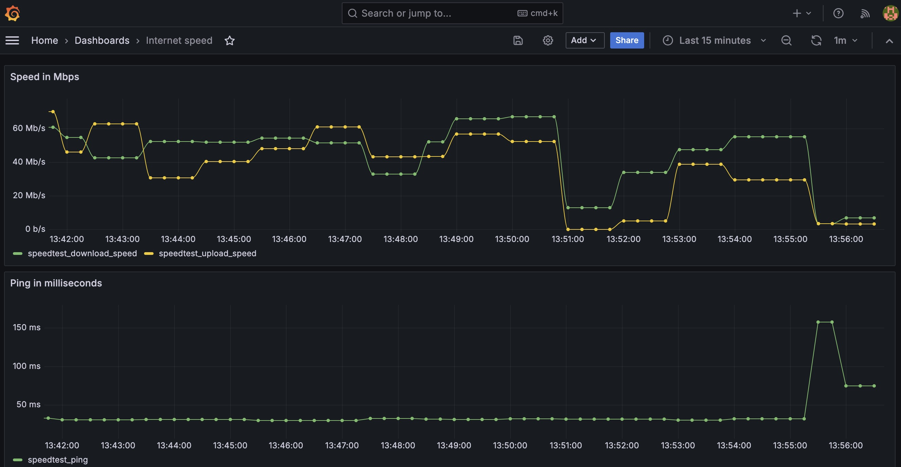

# internet_metrics
Docker compose to setup internet speed exporter with prometheus and grafana to monitor and visualize

# requirements
docker

# STEP 1. build exporter
cd to cloned directory and run
```
docker build -t speedtest-exporter --build-arg PUSH_IP=<IP> .
```
# STEP 2. run container
```
docker run -d --restart unless-stopped speedtest-exporter 
```
# STEP 3. access grafana dashboard in browser
Access http://<PUSH_IP>:3000.  
Initial user password admin/admin  
Check internet-speed dashboard in grafana  
Prometheus instance will be available at:
http://<PUSH_IP>:9090/

# STEP 4. stop containers
```
docker stop <container-id>
```

# How it looks



# Disclaimer
The metrics are collected using speedtest-cli. All metrics are not entirely reliable as per the details in:
https://github.com/sivel/speedtest-cli
